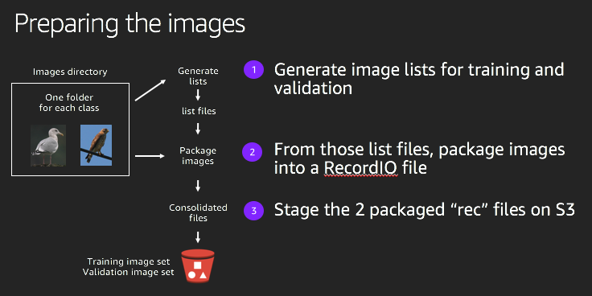

# Lab 1 - Prepare images for training

In this lab, you will prepare the images for training.  We will be using SageMaker's [Image Classification algorithm](https://docs.aws.amazon.com/sagemaker/latest/dg/image-classification.html) against these images.  This algorithm performs supervised learning, taking an image as input and classifying it into one of many output categories.  In this workshop, the output categories are species of birds like Cardinal and Goldfinch.  The algorithm uses a convolutional neural network called ResNet, and is best trained with a dataset of images packaged in [Apache MXNet RecordIO](https://mxnet.incubator.apache.org/architecture/note_data_loading.html) format.  

**have them create an S3 bucket or provide one for them**

**deeplens-sagemaker-20181128-test1 naming convention so that DeepLens can write to it**

These are the high level steps you will take for Lab 1, all of which will be accomplished using a SageMaker notebook:

1. Explore the dataset
2. Use the [im2rec](https://mxnet.incubator.apache.org/faq/recordio.html) utility to package the images
3. Upload the packaged images to S3 for training

## Using a SageMaker notebook to perform the lab

Prior to the workshop, a SageMaker notebook instance called `BirdClassificationWorkshop` was created in your account.  Open the [Amazon SageMaker console[(https://console.aws.amazon.com/sagemaker/)] and click on `Notebook instances` in the left hand panel.  If the `Status` of the instance is `InService`, click on `Open` to open the notebook instance.  If not, click on `Start` to first start the instance before opening it.

Once you have opened the instance, open the Jupyter notebook called `LabNotebook.ipynb` in the `bird-classification-workshop` folder in the `Files` tab of the instance.

Follow the instructions in the notebook to complete the lab.

* counts of images for each species
* distribution of image sizes
* species class id's and species names

## Acknowledgement to Cornell Lab of Ornithology for the NABirds images

This workshop leverages the [NABirds]( http://dl.allaboutbirds.org/nabirds) dataset, which is provided by the [Cornell Lab of Ornithology](http://merlin.allaboutbirds.org/the-story/) whose mission is to help people answer the question "What is that bird?"  The licensing agreement does not permit us to distribute their dataset.  Instead, your instructor will provide a temporary link to use a subset of bird species during this workshop.

The full dataset contains nearly 50,000 images, and the compressed download file is around 9 GB.  In addition to a long download time, training a neural network using a dataset of this size would take many hours.  That is not feasible in a 2-hour workshop.  If you would like to work with the full dataset later on to continue your learning, you can go [here](http://dl.allaboutbirds.org/nabirds) to register to download it yourself for non-commercial research purposes.

## Package the images (move this pic to the notebook)

The following figure illustrates the process of packaging the images.

For this workshop, we have provided a script to do the packaging.  The script invokes the `im2rec` utility to create packaged RecordIO files.  You will perform this in the SageMaker notebook.

## Navigation

Go to the [Next Lab](lab2-train-model.md)

[Home](../README.md) - [Lab 1](lab1-image-prep.md) - [Lab 2](lab2-train-model.md) - [Lab 3](lab3-host-model.md) - [Lab 4](lab4-trigger-inference-from-s3.md) - [Lab 5](lab5-deeplens-detect-and-classify.md) - [Lab 6](lab6-text-notification.md) - [Troubleshooting](troubleshooting.md)
